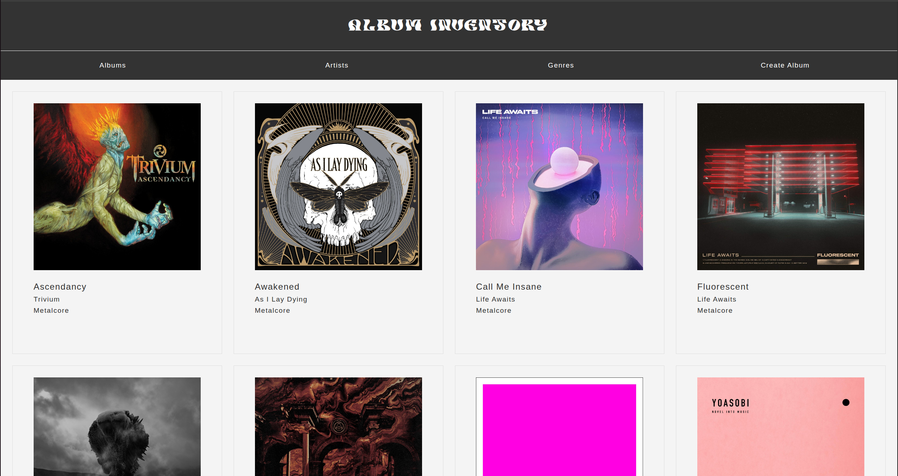
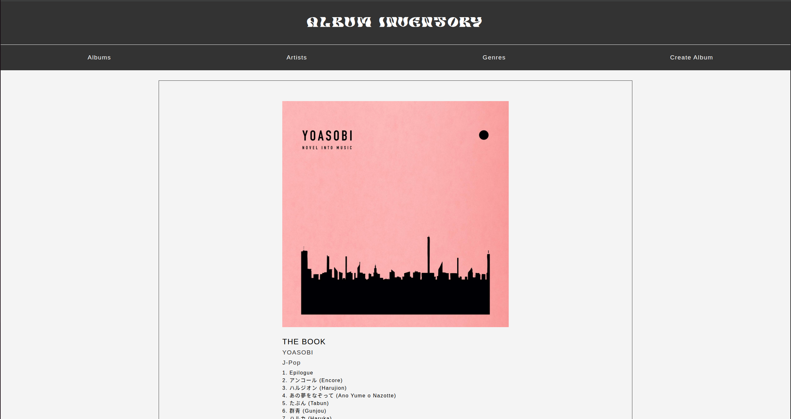
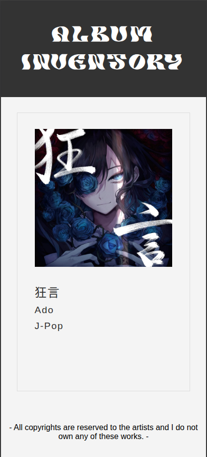
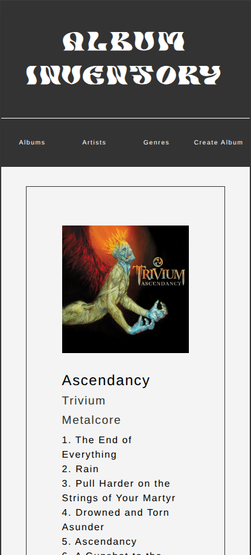

# Album Inventory Application

A simple web application for managing an inventory of music albums. This application allows users to view, add, and manage album records, including details like title, artist, and release year.

## Features

*   **View Albums:** Browse a list of all albums in the inventory.
*   **Add New Album:** Create new album entries with relevant details.
*   **Detailed Album View:** See specific information for each album.
*   **Database Integration:** Persistent storage for album data.

## Technologies Used

*   **Backend:** Node.js, Express.js
*   **Frontend:** EJS (Embedded JavaScript) for templating, HTML, CSS
*   **Database:** PostgreSQL (or similar, based on `db/pool.js` and `db/queries.js` - assuming a relational database)
*   **Styling:** Custom CSS, Fonts (BLUEOCEAN.ttf)

## Setup

Follow these steps to get the application up and running on your local machine.

### Prerequisites

Before you begin, ensure you have the following installed:

*   [Node.js](https://nodejs.org/en/download/) (LTS version recommended)
*   [npm](https://www.npmjs.com/get-npm) (comes with Node.js)
*   [PostgreSQL](https://www.postgresql.org/download/) (or your chosen database system)

### Installation

1.  **Clone the repository:**
    ```bash
    git clone <your-repository-url>
    cd Album-Inventory-Application
    ```
    (Replace `<your-repository-url>` with the actual URL of your Git repository)

2.  **Install Node.js dependencies:**
    ```bash
    npm install
    ```

### Database Setup

This application uses a database to store album information. You'll need to set up your database and configure the connection.

1.  **Configure Database Connection:**
    Edit `db/pool.js` to match your database credentials (host, user, password, database name).

    *Example `db/pool.js` configuration:*
    ```javascript
    const { Pool } = require('pg'); // Assuming PostgreSQL
    const pool = new Pool({
        user: 'your_db_user',
        host: 'localhost',
        database: 'album_inventory_db',
        password: 'your_db_password',
        port: 5432, // Default PostgreSQL port
    });
    module.exports = pool;
    ```
    (Adjust the above example based on your actual database type and configuration.)

2.  **Create Database and Tables:**
    You can use the provided scripts to set up your database schema.

    *   **Populate Database (create tables and add sample data):**
        ```bash
        node db/populatedb.js
        ```
    *   **Drop Tables (for development/reset):**
        ```bash
        node db/droptable.js
        ```

## Running the Application

After setting up the database and installing dependencies, you can start the application:

```bash
npm start
```

The application will typically run on `http://localhost:3000` (or another port if configured in `app.js`). Open your web browser and navigate to this address.

## Usage

*   **Homepage:** Access the main list of albums.
*   **Add Album:** Look for a link or button to add a new album. Fill in the form and submit.
*   **View Details:** Click on an album title to see its detailed information.

## Screenshots

### Desktop




### Mobile




---
